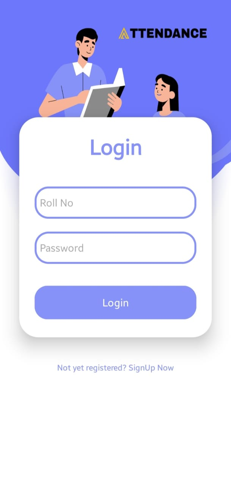
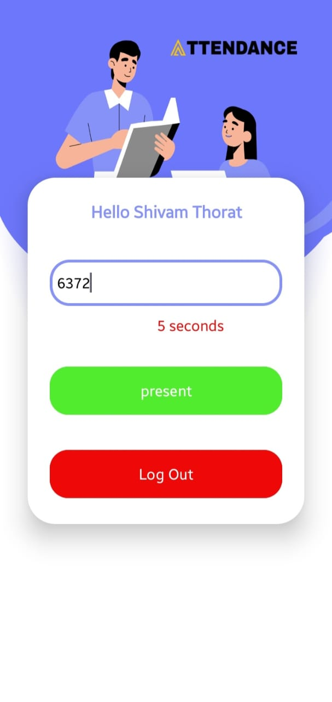

<h1>Student Login App - Online Attendance System</h1>

*** 

<h2>Introduction</h2>

Welcome to the Student Login App for our Online Attendance System! This mobile application is designed to facilitate student attendance tracking in an easy and efficient manner. Below is a guide to help you get started.

<h2>Getting Started</h2>
<h3>Installation</h3>
1. Download and install the Student Login App on your mobile device.

2. Open the app and proceed with the login process.

3. Automated Absence Recording:

<h3>Login</h3>

1. Roll Number and Password:
<ul>
    <li>Enter your assigned Roll Number and Password to log in securely.</li>
</ul>

2. Teacher Shared OTP:

<ul>
    <li>After successful login, you will be prompted to enter the OTP (One-Time Password) shared by your teacher for the current class session.</li>
</ul>

<h3>Marking Attendance</h3>

1. Enter OTP:
<ul>
    <li>Once logged in, input the OTP within the specified time limit provided by your teacher.</li>
</ul>

2. Click on "Present" Button:

<ul>
    <li>After entering the correct OTP, click on the "Present" button to mark your attendance for the current class session.</li>
</ul>

<h2>Important Notes</h2>

* Ensure that you enter the correct Roll Number and Password to log in successfully.
* Pay attention to the time limit for entering the OTP. The OTP is time-sensitive and must be entered promptly to mark attendance.

***

Thank you for using our Online Attendance System! Your commitment to using this app contributes to a more efficient and streamlined attendance tracking process.

